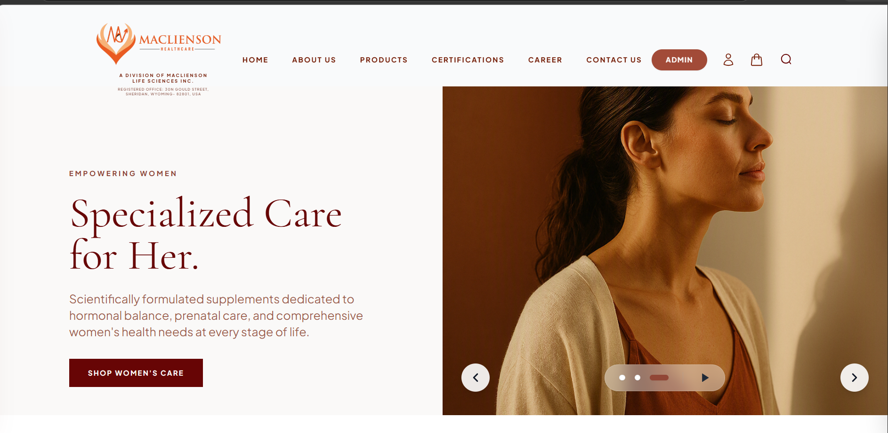
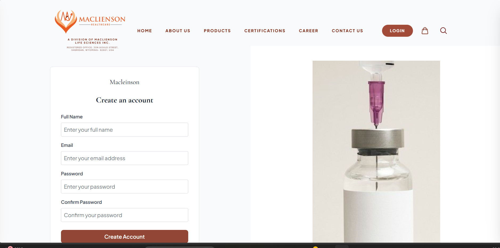
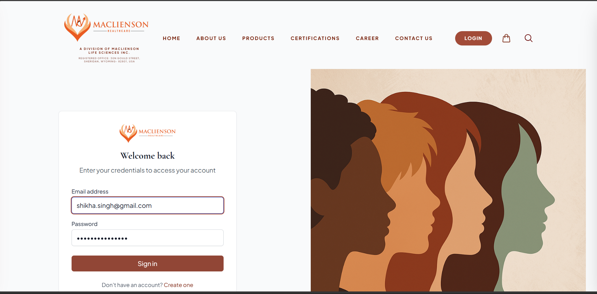
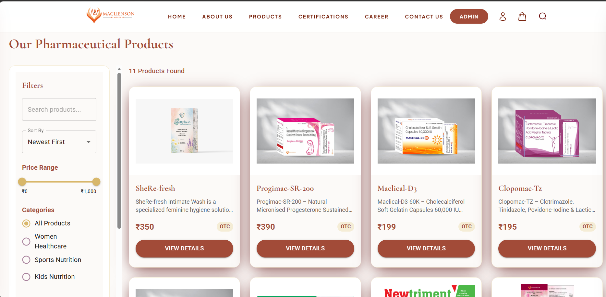
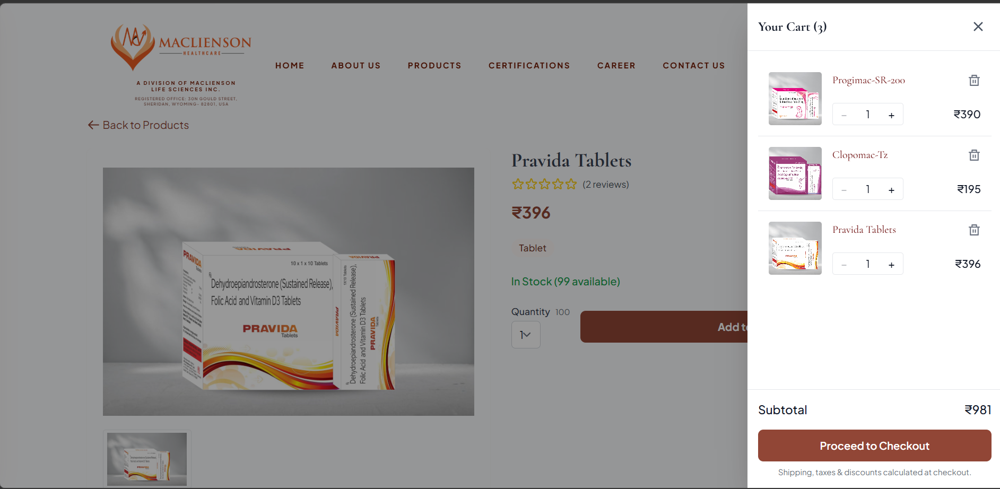
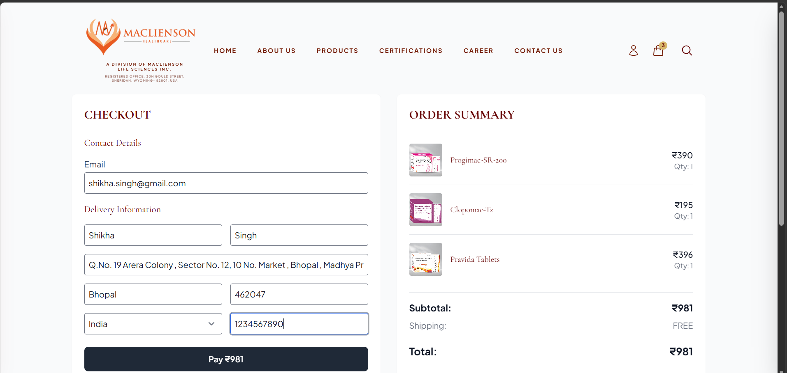
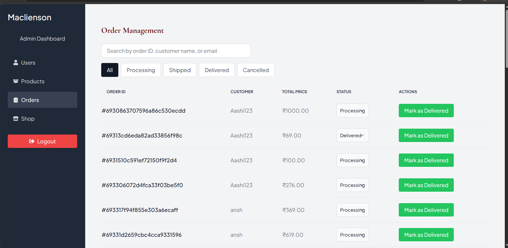

# Maclienson Healthcare
Maclienson Healthcare is a premium, full-stack pharmaceutical e-commerce and corporate website. 
---
<p align="center">
  
  
  
  
  
</p>
## Project Overview

Maclienson Healthcare is a full-stack pharmaceutical e-commerce platform built using MERN stack. The platform enables users to browse healthcare products, manage their shopping cart, place orders securely, and complete payments through Razorpay. It also provides administrative features for managing products, orders, and users.

The project was developed to simulate a real-world healthcare e-commerce solution while implementing secure authentication, payment integration, role-based access control, and scalable state management.

**Target users:** Individuals seeking specialized nutritional supplements, women's healthcare products, sports nutrition, and general pharmaceutical goods.
**Business purpose:** To establish a strong digital presence for Maclienson Healthcare, facilitate direct-to-consumer sales, and educate patients through integrated clinical research highlights.

---
# Screenshots
## Home Page
<p align="center">
  
</p>

## Create Account
<p align="center">
  
</p>

## Login Page
<p align="center">
  
</p>

## Products Page
<p align="center">
  
</p>

## Product Details Page

<p align="center">
  
</p>

## Cart

<p align="center">
  
</p>

## Checkout Page
<p align="center">
  
</p>

## Admin Dashboard

<p align="center">
  
</p>


## Key Features

- **User Authentication:** Secure JWT-based login/register flow.
- **Role-Based Access Control:** Distinct roles for `customer` and `admin`.
- **Product Catalog:** Dynamic product grids with detailed specifications.
- **Search & Filtering Functionality:** Advanced product filtering by category, price, and attributes.
- **Shopping Cart:** Highly responsive cart system.
- **Guest Cart Support:** Users can add items to their cart without being logged in (persisted locally).
- **Cart Merge on Login:** Guest carts seamlessly merge with the user's database cart upon authentication.
- **Checkout Flow:** Multi-step checkout with shipping address validation.
- **Razorpay Integration:** Secure, server-verified payment processing for Indian users.
- **Order Management:** Users can track their orders; Admins can update order statuses (Processing, Shipped, Delivered).
- **Admin Dashboard & Analytics:** Comprehensive admin panel to manage users, products, and view sales analytics.
- **Image Uploads:** Cloudinary integration for scalable, optimized product image hosting.
- **Responsive Design:** A custom Terracotta/Warm Earthy design system built with Tailwind CSS, ensuring a perfect experience on mobile and desktop.

---

## Tech Stack

### Frontend
- **Framework:** React.js (via Vite)
- **Styling:** Tailwind CSS, Framer Motion (for GPU-accelerated animations)
- **UI Components:** Material UI (MUI), Lucide React, React Icons
- **Routing:** React Router v6
- **Data Visualization:** Recharts

### Backend
- **Runtime:** Node.js
- **Framework:** Express.js
- **File Uploads:** Multer, Streamifier

### Database
- **Database:** MongoDB
- **ODM:** Mongoose

### Authentication
- **Strategy:** JSON Web Tokens (JWT) stored in HTTP-Only cookies
- **Password Hashing:** Bcrypt.js

### Payment Gateway
- **Provider:** Razorpay

### Third-Party Services
- **Image Hosting:** Cloudinary
- **Deployment:** Vercel (Frontend planned)


---

## 📂 Folder Structure

```text
macliensonhealthcare/
├── backend/
│   ├── config/
│   ├── data/
│   ├── middleware/
│   ├── models/
│   ├── routes/
│   ├── utils/
│   ├── package.json
│   └── server.js
│
├── frontend/
│   ├── public/
│   ├── src/
│   │   ├── api/
│   │   ├── assets/
│   │   ├── components/
│   │   │   ├── Admin/
│   │   │   ├── Cart/
│   │   │   ├── Common/
│   │   │   ├── Layout/
│   │   │   ├── Legal/
│   │   │   └── Products/
│   │   ├── pages/
│   │   ├── redux/
│   │   │   └── slices/
│   │   ├── utils/
│   │   ├── App.jsx
│   │   ├── index.css
│   │   └── main.jsx
│   ├── package.json
│   └── vite.config.mjs
│
├── docs/
│   └── images/
│
├── .gitignore
└── README.md
```
---

## 🌐 Live Website

[www.macliensonhealthcare.com](https://www.macliensonhealthcare.com)
---

## 👨‍💻 Author

**Aashi Purohit**

- GitHub: [aashipurohit](https://github.com/aashipurohit)
- LinkedIn: [Aashi Purohit](https://www.linkedin.com/in/aashi-purohit)


